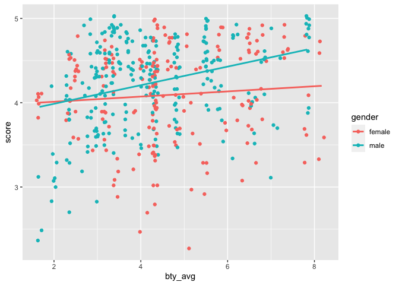
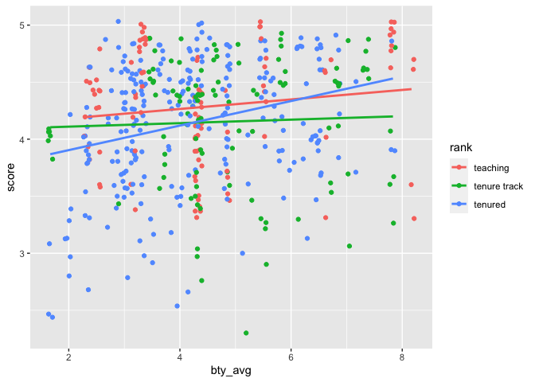

Lab 10 - Grading the professor, Pt. 2
================
Lindsey Wilson
5/3/23

### Load packages and data

``` r
library(tidyverse) 
library(tidymodels)
library(openintro)
```

``` r
evals = evals
```

## Part 1

### Exercise 1

Let’s do a simple linear regression predicting `score` from `bty_avg`,
like we did in the previous lab:

``` r
m_bty <- linear_reg() %>%
  set_engine("lm") %>%
  fit(score ~ bty_avg, data = evals)

tidy(m_bty)
```

    ## # A tibble: 2 × 5
    ##   term        estimate std.error statistic   p.value
    ##   <chr>          <dbl>     <dbl>     <dbl>     <dbl>
    ## 1 (Intercept)   3.88      0.0761     51.0  1.56e-191
    ## 2 bty_avg       0.0666    0.0163      4.09 5.08e-  5

``` r
glance(m_bty)
```

    ## # A tibble: 1 × 12
    ##   r.squared adj.r.squared sigma statistic   p.value    df logLik   AIC   BIC
    ##       <dbl>         <dbl> <dbl>     <dbl>     <dbl> <dbl>  <dbl> <dbl> <dbl>
    ## 1    0.0350        0.0329 0.535      16.7 0.0000508     1  -366.  738.  751.
    ## # ℹ 3 more variables: deviance <dbl>, df.residual <int>, nobs <int>

It looks like R-squared here (0.035) is slightly larger than adjusted
R-squared (0.033).

## Part 2

### Exercise 2

Now let’s include gender into the model:

``` r
m_bty_gen <- linear_reg() %>%
  set_engine("lm") %>%
  fit(score ~ bty_avg * gender, data = evals)

tidy(m_bty_gen)
```

    ## # A tibble: 4 × 5
    ##   term               estimate std.error statistic   p.value
    ##   <chr>                 <dbl>     <dbl>     <dbl>     <dbl>
    ## 1 (Intercept)          3.95      0.118      33.5  2.92e-125
    ## 2 bty_avg              0.0306    0.0240      1.28 2.02e-  1
    ## 3 gendermale          -0.184     0.153      -1.20 2.32e-  1
    ## 4 bty_avg:gendermale   0.0796    0.0325      2.45 1.46e-  2

``` r
glance(m_bty_gen)
```

    ## # A tibble: 1 × 12
    ##   r.squared adj.r.squared sigma statistic     p.value    df logLik   AIC   BIC
    ##       <dbl>         <dbl> <dbl>     <dbl>       <dbl> <dbl>  <dbl> <dbl> <dbl>
    ## 1    0.0713        0.0652 0.526      11.7 0.000000200     3  -357.  725.  745.
    ## # ℹ 3 more variables: deviance <dbl>, df.residual <int>, nobs <int>

``` r
ggplot(evals,
       aes(x = bty_avg, y = score,  color = gender)) + 
  geom_jitter() +
  geom_smooth(method = "lm", se = FALSE)
```

    ## `geom_smooth()` using formula = 'y ~ x'

<!-- -->

The linear model here is `score` = 3.950 + 0.031(`bty_avg`) -0.184
(`gendermale`) + 0.080 (`bty_avg:gendermale`).

R-squared = 0.071

Adjusted R-squared = 0.065

### Exercise 3

The predicted evaluation for a female professor with an average
attractiveness rating of zero is 3.747. Males are on average evaluated
0.18. pts lower than females, and score is predicted to increase by 0.03
points for a one point increase in attractiveness. The effect of
attractiveness is also 0.08. pts stronger for males than for females.

### Exercise 4

About 7.1% of the variability in `score` is explained by `m_bty_gen`.
However, this may be somewhat inflated due to the presence of multiple
predictors, so adjusted r-squared (6.5%) is likely a better metric.

### Exercise 5

The equation of the line for just male professors would be `score` =
3.766 + 0.111(`bty_avg`)

### Exercise 6

For professor who receive the same beauty rating, the model suggests
that male professors receive higher evaluations than female professors.

### Exercise 7

The effect of attractiveness on evaluations is pretty substantially
stronger for male professors than it is for female professors. This is
evidenced by the interaction term, which is much greater than the
baseline slope for `bty_avg`; being male causes the effect of
attractiveness to more than triple compared to the same effect for
females.

### Exercise 8

The adjusted R-squared of `m_bty` is 0.033, and that increases to 0.065
when we add gender into the model in `m_bty_gen`. This means that, when
already have information about attractiveness ratings, adding
information about gender helps explain about 3% more variance.

### Exercise 9

The slope of gender in `m_bty` is 0.067, but that decreases to 0.031 in
`m_bty_gen`. That means that the addition of gender to the model
decreases the estimated effect of attractiveness on evaluations.

### Exercise 10

Lets swap out rank for gender in our model:

``` r
m_bty_rank <- linear_reg() %>%
  set_engine("lm") %>%
  fit(score ~ bty_avg * rank, data = evals)

tidy(m_bty_rank)
```

    ## # A tibble: 6 × 5
    ##   term                     estimate std.error statistic  p.value
    ##   <chr>                       <dbl>     <dbl>     <dbl>    <dbl>
    ## 1 (Intercept)                4.10      0.150    27.4    1.80e-98
    ## 2 bty_avg                    0.0417    0.0314    1.33   1.84e- 1
    ## 3 ranktenure track          -0.0188    0.230    -0.0818 9.35e- 1
    ## 4 ranktenured               -0.409     0.182    -2.25   2.52e- 2
    ## 5 bty_avg:ranktenure track  -0.0264    0.0463   -0.570  5.69e- 1
    ## 6 bty_avg:ranktenured        0.0659    0.0392    1.68   9.38e- 2

``` r
glance(m_bty_rank)
```

    ## # A tibble: 1 × 12
    ##   r.squared adj.r.squared sigma statistic   p.value    df logLik   AIC   BIC
    ##       <dbl>         <dbl> <dbl>     <dbl>     <dbl> <dbl>  <dbl> <dbl> <dbl>
    ## 1    0.0587        0.0484 0.531      5.70 0.0000409     5  -360.  735.  764.
    ## # ℹ 3 more variables: deviance <dbl>, df.residual <int>, nobs <int>

``` r
ggplot(evals,
       aes(x = bty_avg, y = score,  color = rank)) + 
  geom_jitter() +
  geom_smooth(method = "lm", se = FALSE)
```

    ## `geom_smooth()` using formula = 'y ~ x'

<!-- -->

Our new equation is `score` = 4.098 + 0.042(`bty_avg`) -
0.019(`ranktenure track`) - 0.409(`ranktenured`) -
0.02(`bty_avg:ranktenure track`) + 0.066(`bty_avg:ranktenured`)

Interpretations are as follows:

- The predicted score for a teaching track professor with an
  attractiveness rating of zero is 4.098

- On average, a 1 pt increase in attractiveness predicts a 0.042 pt
  increase in evaluation

- Tenure track professors on average have 0.019 pt lower evaluations
  than teaching professors

- Tenured professors on average have 0.409 pt lower evaluations than
  teaching professors

- The slope for attractiveness is 0.026 lower for tenure track than for
  teaching professors

- The slope for attractiveness is 0.066 higher for tenured than for
  teaching professors

## Part 3

### Exercise 11

I would probably predict `cls_did_eval` to be the worst predictor of
`score`; it doesn’t seem like the raw number of students who completed
an evaluation would really have anything to do with score, especially
since classes vary in size.

### Exercise 12

Let’s check my suspicions by actually running the model:

``` r
m_cls_did_eval <- linear_reg() %>%
  set_engine("lm") %>%
  fit(score ~ cls_did_eval, data = evals)

tidy(m_cls_did_eval)
```

    ## # A tibble: 2 × 5
    ##   term         estimate std.error statistic p.value
    ##   <chr>           <dbl>     <dbl>     <dbl>   <dbl>
    ## 1 (Intercept)  4.15      0.0326      127.     0    
    ## 2 cls_did_eval 0.000759  0.000562      1.35   0.177

``` r
glance(m_cls_did_eval)
```

    ## # A tibble: 1 × 12
    ##   r.squared adj.r.squared sigma statistic p.value    df logLik   AIC   BIC
    ##       <dbl>         <dbl> <dbl>     <dbl>   <dbl> <dbl>  <dbl> <dbl> <dbl>
    ## 1   0.00395       0.00179 0.543      1.83   0.177     1  -374.  753.  766.
    ## # ℹ 3 more variables: deviance <dbl>, df.residual <int>, nobs <int>

Looks like I was right; the number of students who completed an
evaluation only explains 0.39% of the variance in evaluation.

### Exercise 13

If you. already have `cls_perc_eval` and `cls_students` in your model,
then you wouldn’t want to also include ’cls_did_eval\` because you can
calculate it from the first two variables. You’re essentially not adding
anything to the model, so any increase you see in R-squared would be
artificial.

### Exercise 14

Here’s a model fit with all of the given variables:

``` r
m_full <- linear_reg() %>%
  set_engine("lm") %>%
  fit(score ~ rank*ethnicity*gender*language*age*cls_perc_eval*cls_students*cls_level*cls_profs*cls_credits*bty_avg, data = evals)

tidy(m_full)
```

    ## # A tibble: 3,072 × 5
    ##    term                  estimate std.error statistic p.value
    ##    <chr>                    <dbl>     <dbl>     <dbl>   <dbl>
    ##  1 (Intercept)            7.67e13   5.19e13    1.48    0.141 
    ##  2 ranktenure track      -4.87e13   1.08e14   -0.450   0.653 
    ##  3 ranktenured            2.01e13   9.10e12    2.21    0.0284
    ##  4 ethnicitynot minority -7.67e13   5.19e13   -1.48    0.141 
    ##  5 gendermale             2.42e13   1.48e13    1.63    0.105 
    ##  6 languagenon-english   -7.67e13   4.81e13   -1.60    0.112 
    ##  7 age                   -2.27e12   1.16e12   -1.95    0.0532
    ##  8 cls_perc_eval         -1.89e12   1.34e12   -1.41    0.160 
    ##  9 cls_students          -2.00e10   3.62e11   -0.0553  0.956 
    ## 10 cls_levelupper        -2.32e13   1.09e13   -2.13    0.0347
    ## # ℹ 3,062 more rows

``` r
glance(m_full)$adj.r.squared
```

    ## [1] 0.4642025

### Exercise 15

Now let’s try to pick out the most important variables to leave in the
model via backward selection. The final model is given below:

``` r
m_full <- linear_reg() %>%
  set_engine("lm") %>%
  fit(score ~ rank*gender*age*cls_perc_eval*cls_level*cls_profs*bty_avg, data = evals)

tidy(m_full)
```

    ## # A tibble: 192 × 5
    ##    term                        estimate std.error statistic p.value
    ##    <chr>                          <dbl>     <dbl>     <dbl>   <dbl>
    ##  1 (Intercept)                   169.      781.     0.216     0.829
    ##  2 ranktenure track              226.     2229.     0.101     0.919
    ##  3 ranktenured                  -543.      772.    -0.703     0.483
    ##  4 gendermale                   -413.      810.    -0.510     0.610
    ##  5 age                            -5.19     21.7   -0.239     0.811
    ##  6 cls_perc_eval                   2.06      6.61   0.311     0.756
    ##  7 cls_levelupper               -166.      781.    -0.213     0.832
    ##  8 cls_profssingle              -411.      548.    -0.751     0.453
    ##  9 bty_avg                        22.0      65.5    0.336     0.737
    ## 10 ranktenure track:gendermale    15.0    2226.     0.00674   0.995
    ## # ℹ 182 more rows

``` r
glance(m_full)$adj.r.squared
```

    ## [1] 0.4310415

### Exercise 16

From our model, here are a couple of interpretations:

- `age`: a one year increase in age predicts a 5.19 point decrease
  evaluation, on average
- `cls_level`: professors of upper level receive evaluations that are on
  average 166 points lower than professors of lower level classes

These coefficients are huge (and don’t make sense for an outcome
variable that ranges from 0 to 5), but that’s probably because there are
so many interactions that work to make the actual slopes for each
variable into reasonable. The slopes for each variable alone are huge so
that by the time all the interactions have been applied there’s
something left.

### Exercise 17

The ideal professor at UT Austin would be:

- Young
- Female
- Attractive
- Tenure track (but not tenured)
- Teaching a lower level class
- The only professor teaching the course in question
- In a class where a large percentage of the class fills out the
  evaluation

### Exercise 18

I wouldn’t be comfortable generalizing these results to apply to any
university, just because UT Austin is a fairly large school and the
slopes for variables that have to do with institutional characteristics
(`cls_perc_eval`, `cls_level`, etc.) might not apply to a smaller school
like Wake. It’s not out of the question that they might, but I wouldn’t
count on it.
